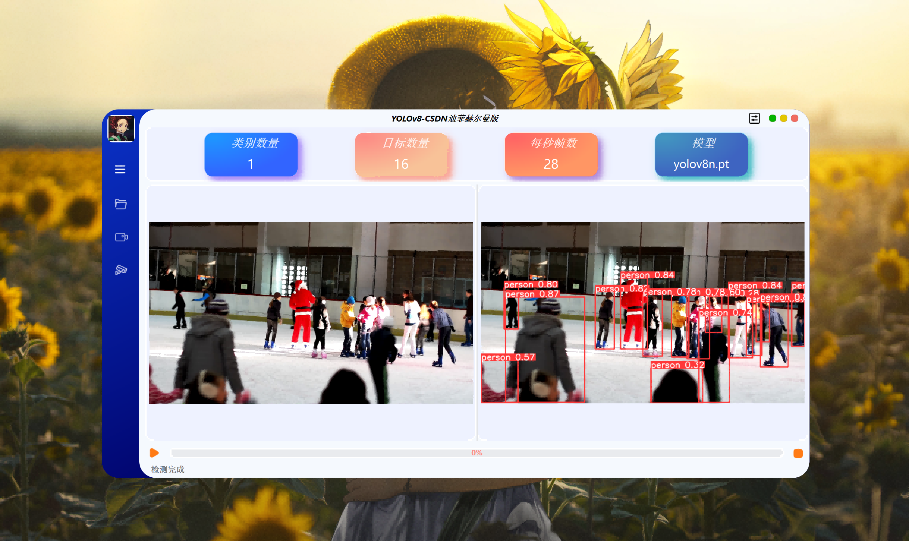

# 检测系统
# Pyqt界面
## 页面效果



## 如何使用
- `python>=3.8`
- `pip install ultralytics==8.1.0` or `git clone --branch v8.1.0 --single-branch https://github.com/ultralytics/ultralytics.git` `pip install -e .`
- `pip install pyside6 chardet`
- `pip install torch==1.12.1+cu113 torchvision==0.13.1+cu113 torchaudio==0.12.1 --extra-index-url https://download.pytorch.org/whl/cu113`
- `python main.py`


## 项目功能
- ✅ 图片推理
- ✅ 视频推理
- ✅ 摄像头推理
- ✅ RTSP 推流
- ✅ 分类任务推理
- ✅ 检测任务推理
- ✅ 分割任务推理
- ✅ 关键点任务推理
- ❌ 追踪任务推理
- ❌ 旋转框任务推理
- ✅ Pytroch (.pt) 格式模型推理
- ✅ ONNX (.onnx) 格式模型推理
- ✅ TensorRT (.engine) 格式模型推理
- ✅ 模型选择
- ✅ 置信度/阈值调整
- ✅ 延迟调整
- ✅ 保存推理结果

## 注意事项
- 跟踪功能未集成。
- 旋转框检测未集成。
- 打包成功可能无法运行。
- 如果想使用自己的模型，您需要先使用 `ultralytics` 来训练 yolov8 模型，然后将训练好的 `.pt/.onnx/.engine` 文件放入 `models/*` 文件夹。
- 如果模型是改进的，请将你整个项目文件导入。
- 如果选择保存结果，结果会保存在 `./run` 路径中。
- UI 设计文件是 `home.ui`，如果修改它，您需要使用 `pyside6-uic home.ui > ui/home.py` 命令来重新生成 `.py` 文件。
- 资源文件是 `resources.qrc`，如果您修改了默认图标，需要使用 `pyside6-rcc resources.qrc > ui/resources_rc.py` 命令来重新生成 `.py` 文件。

# 推流
基于瑞芯微 RV1106 平台的高性能边缘智能网络摄像头设计，支持 RTSP 推流、WebRTC、mp4 离线录制、WebSocket 网页实时预览

## 核心功能

- 采集与处理
	- SimpleIPC 模式：硬件链路直通，低开销稳定推流
- 多路媒体分发
	- RTSP 实时推流
	- WebRTC 低延迟预览
	- WebSocket 网页 H264 预览
	- MP4 本地离线录制
- 统一 HTTP API
	- 设备状态、模式切换、流服务控制、Python 工程管理

## 技术栈

- C++17 + CMake
- pybind11 嵌入 Python 3.11
- cpp-httplib（HTTP API）
- libdatachannel（WebRTC）
- spdlog（日志）
- Rockchip RKMPI（VI/VPSS/VENC）

## 快速开始

### 1. 编译

```bash
# 调用预设的配置 (例如 Debug)
cmake --preset Debug

# 使用预设进行构建
cmake --build --preset Debug
```

### 2. 一键部署到板端

```bash
AIPC_REMOTE_HOST=root@<device_ip> AIPC_REMOTE_DIR=/root/aipc ./assets/install_rsync.sh
```

### 3. 板端启动

```bash
ssh root@<device_ip>
cd /root/aipc/bin
./start_app.sh --daemon
```

### 4. 访问控制台

- Web UI: `http://<device_ip>:8080`
- 健康状态: `http://<device_ip>:8080/api/status`

## 常用接口

- `POST /api/ai/switch`：切换 AI 模式（`visiong` / `none`）
- `GET /api/python/projects`：获取 Python 工程列表
- `POST /api/python/deploy`：部署指定 Python 工程
- `POST /api/rtsp/start`：启动 RTSP
- `POST /api/webrtc/start`：启动 WebRTC

## 目录参考

- `src/`：核心 C++ 服务与媒体管线
- `assets/`：部署脚本
- `www/`：前端控制台
- `docs/`：架构与调试文档
