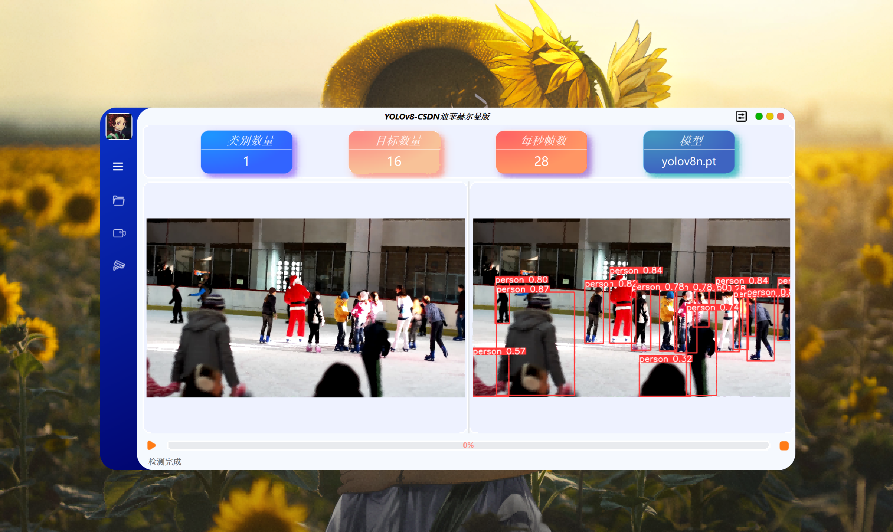

# 裂缝检测系统

面向裂缝检测场景的视觉与视频采集系统，由 PC 端检测客户端和 Luckfox RV1106 板端推流服务组成：

- `vision-client/`：基于 PySide6 和 Ultralytics YOLO 的桌面客户端。
- `stream-server/`：运行于 Luckfox/RV1106 的 C++17 推流服务及 Web 控制台。



## 功能概览

### 视觉客户端

- 支持图片、视频、摄像头和 RTSP 输入。
- 支持分类、检测、分割和关键点任务。
- 支持 PyTorch（`.pt`）、ONNX（`.onnx`）和 TensorRT（`.engine`）模型。
- 支持模型选择、置信度与阈值调整、推理延迟调整和结果保存。

### 推流服务

- 支持 SimpleIPC 和 USB UVC 两种采集模式。
- 支持 RTSP、WebRTC 和 WebSocket H.264 实时预览。
- 支持 MP4 本地录制。
- 提供 Web 控制台和 HTTP API，可查询状态并控制采集模式、分辨率及流服务。
- UVC 双目图像以左右目水平拼接帧传输，拆分与检测由客户端或算法层负责。

## 双目图像采集

当前使用 `HBVCAM-4M2214HD-2 V11` USB 2.0 UVC 双目相机，驱动为 Linux `uvcvideo`。设备节点会随插拔变化，服务默认根据 capture capability、MJPEG 格式、分辨率和帧率自动发现合格的 `/dev/videoX`，不依赖固定节点号。

相机输出的是一张左右目水平拼接的 MJPEG 帧，不是两路独立视频。板端不拆分左右目，而是通过以下硬件链路转为 H.264 后交给现有分发服务：

```text
UVC MJPEG -> V4L2 mmap -> RKMPI VDEC (YUV422P)
           -> RGA (NV12) -> RKMPI VENC (H.264)
           -> RTSP / WebRTC / WebSocket Preview / MP4
```

当前可在 Web 控制台或 `POST /api/pipeline/resolution` 中冷切换三档双目分辨率；切换会重建 capture、VDEC、RGA、VENC 和 dispatcher，并短暂中断视频流。

| 拼接分辨率 | 单目分辨率 | 配置帧率 | 最近一次板端验收：采集 / H.264 输出 |
| --- | --- | ---: | ---: |
| `3840x1080` | `1920x1080` | 30 fps | 约 17.66 / 6.99 fps |
| `2560x720` | `1280x720` | 30 fps | 约 16.64 / 11.40 fps |
| `1280x480` | `640x480` | 30 fps | 约 15.29 / 15.29 fps |

以上帧率是最近一次三档切换验收的实际采样值，不是能力枚举中的标称值。三档测试的 V4L2 sequence gap 均为 0，未发现 VDEC、RGA 或 VENC send error；RTSP 均报告正确的 H.264 分辨率，页面中的双目画面和切换交互已通过人工验收。单独验收 `1280x480` 硬件链路时曾达到约 30 fps，因此实际帧率仍会受当前分辨率、处理负载和运行条件影响。

原始 MJPEG 能力中，`1280x480` 推荐使用 MJPEG 30 fps；同分辨率 YUYV 仅约 10 fps，不适合作为完整双目 30 fps 的替代方案。更完整的设备能力、供电限制、采集命令和画质排障见[双目相机图像采集开发文档](./doc/开发文档/双目相机图像采集开发文档.md)。

## 视觉客户端

### 环境准备

- Python 3.8 或更高版本。
- 根据本机 CPU/CUDA 环境安装兼容的 PyTorch。

以下命令提供一套基于 Ultralytics 8.1.0 的安装示例：

```bash
cd vision-client
python -m venv .venv
source .venv/bin/activate
pip install ultralytics==8.1.0 pyside6 chardet
```

CUDA 11.3 环境可使用：

```bash
pip install torch==1.12.1+cu113 torchvision==0.13.1+cu113 \
  torchaudio==0.12.1 --extra-index-url https://download.pytorch.org/whl/cu113
```

### 启动

客户端依赖相对路径读取模型和资源，应在 `vision-client/` 中运行：

```bash
cd vision-client
python main.py
```

自定义模型按任务放入 `vision-client/models/` 下对应的 `classify/`、`detect/`、`pose/` 或 `segment/` 目录。

## 推流服务

### 配置与构建

首次获取源码时初始化子模块，然后使用项目提供的交叉编译 preset：

```bash
git submodule update --init --recursive
cd stream-server
cmake --preset Debug
cmake --build --preset Debug
```

Web 控制台可单独构建：

```bash
cd stream-server/www
npm ci
npm run build
```

### 部署到 Luckfox

当前板端地址为 `root@192.168.5.9`。部署脚本会构建 Web 控制台、执行 CMake install，并将安装目录同步到 `/root/aipc`：

```bash
AIPC_REMOTE_HOST=root@192.168.5.9 \
AIPC_REMOTE_DIR=/root/aipc \
stream-server/assets/install_rsync.sh
```

### 板端启动

```bash
ssh root@192.168.5.9

# USB UVC 双目相机模式；默认自动发现合格设备
/root/aipc/bin/start_app.sh --mode uvc --daemon

# SimpleIPC 模式
/root/aipc/bin/start_app.sh --mode simple_ipc --daemon
```

如需显式指定 UVC 节点，可在启动命令前设置 `AIPC_UVC_DEVICE=/dev/videoX`。停止服务使用：

```bash
/root/aipc/bin/stop_app.sh
```

### 访问入口

- Web 控制台：`http://192.168.5.9:8080`
- 系统状态：`GET http://192.168.5.9:8080/api/status`
- Pipeline 状态：`GET http://192.168.5.9:8080/api/pipeline/status`
- RTSP：`rtsp://192.168.5.9:554/live/0`

常用控制接口：

- `GET /api/producer/status`、`POST /api/producer/switch`
- `POST /api/pipeline/resolution`
- `GET /api/rtsp/status`、`POST /api/rtsp/start`、`POST /api/rtsp/stop`
- `GET /api/webrtc/status`、`POST /api/webrtc/start`、`POST /api/webrtc/stop`
- `GET /api/record/status`、`POST /api/record/start`、`POST /api/record/stop`

## 项目目录

```text
vision-client/          PySide6 + YOLO 桌面客户端
stream-server/          RV1106 C++ 推流服务
stream-server/src/      HTTP、媒体生产与媒体分发
stream-server/www/      Svelte/Vite Web 控制台
stream-server/assets/   构建、启动和部署脚本
memory-bank/            当前设计、实施计划、进度和架构记录
doc/                    开发与技术文档
camera-information/     USB 双目相机资料
```

开发约束与 agent 工作规则见 `AGENTS.md`；UVC 采集和图像质量排障见 `doc/开发文档/双目相机图像采集开发文档.md`。
